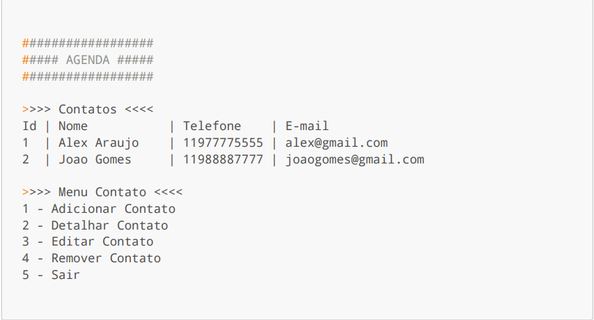

  
  <h1 style="font-size: 20px;"><b>AGENDA DE CONTATOS</b></h1>

Projeto desenvolvido pelo grupo 5 da turma 1173 | Santander Coders 2024 para finalizar o módulo de Lógica de Programação.

<h1 align="center">
  
</h1>

## Objetivo do Projeto:
+ Desenvolver um sistema de agenda de contatos que permita ao usuário adicionar, remover, buscar e listar contatos.
  
# AGENDA 

Requisitos funcionais

RN1: Não é permitido armazenar contatos com telefones ja cadastrados;

 RN2: Para realizar as ações (detalhar, editar e remover), será necessário informar o telefone do contato; 

# Linguagem
+ JAVA

## Integrantes

<table align="center">
  <tr>
    <td align="center">
       
      <b>Ana Laura Marques Rodrigues</b> 
      <a href="https://github.com/lauluah" target="_blank">GitHub</a>
    </td>
    <td align="center">
       
      <b>Arthur Gabriel De Menezes Viana</b> 
      <a href="https://github.com/arthurgmv" target="_blank">GitHub</a>
    </td>
    <td align="center">
       
      <b>Lucas Kaique Rocha Nascimento</b> 
      <a href="https://github.com/LucasKaique131" target="_blank">GitHub</a>
    </td>
    <td align="center">
       
      <b>Mariana Lainara Silva</b> 
      <a href="https://github.com/la1ni" target="_blank">GitHub</a>
    </td>
    <td align="center">
       
      <b>Tainá Souza Peixoto</b> 
      <a href="https://github.com/peixotots" target="_blank">GitHub</a>
    </td>
  </tr>
</table>

## Principais desafios encontrados no projeto:
- **Limitação do Uso de Recursos**: Por se tratar de um projeto focado em conceitos iniciais de lógica de programação, tivemos que limitar o uso de recursos mais avançados.
- **Divisão de Tarefas**: Tivemos que dividir as tarefas de forma que cada integrante pudesse contribuir com o projeto.
- **Integração de Códigos**: Tivemos que integrar os códigos de cada integrante para que o projeto funcionasse corretamente.

## Parte Mais Interessante
- **Aprendizado**: Tivemos a oportunidade de aprender mais sobre a linguagem Java, Git e GitHub e a IDE IntelliJ IDEA.
- **Desenvolvimento de um Projeto Completo**: Conseguimos desenvolver um projeto completo, com várias opções de interação com o usuário.
- **Desenvolvimento Colaborativo**: Melhoramos nossa habilidade de trabalhar em equipe, dividindo tarefas e trocando conhecimento.

## O que pode ser melhorado:
