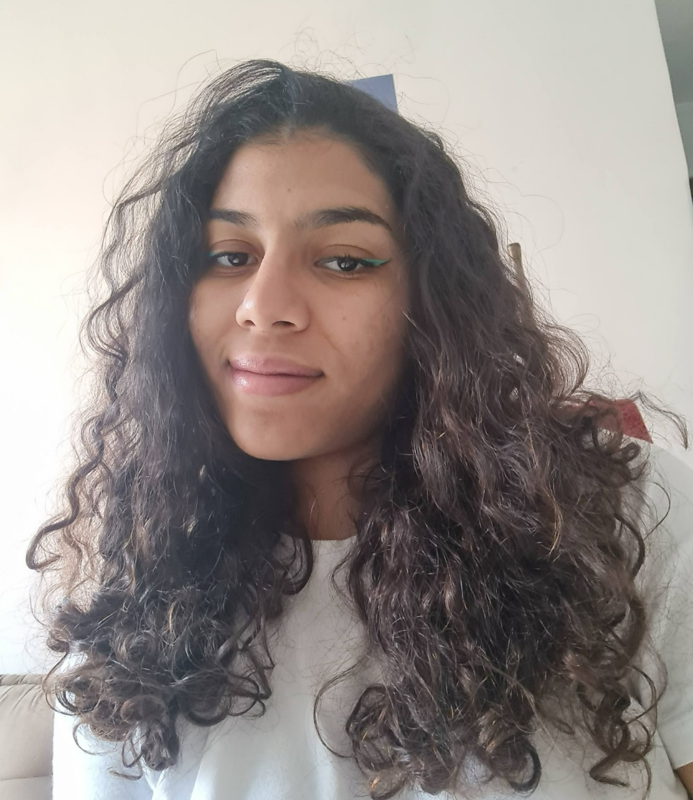

  
  <b>AGENDA DE CONTATOS</b>

Projeto desenvolvido pelo grupo 5 da turma 1173 | Santander Coders 2024 para finalizar o módulo de Lógica de Programação.

<h1 align="center">
  
</h1>

## Sobre o projeto
+

# Linguagem
+ JAVA

## Integrantes

<table align="center">
  <tr>
    <td align="center">
       
      <b>Ana Laura Marques Rodrigues</b> 
      <a href="https://github.com/lauluah" target="_blank">GitHub</a>
    </td>
    <td align="center">
       
      <b>Arthur Gabriel De Menezes Viana</b> 
      <a href="https://github.com/arthurgmv" target="_blank">GitHub</a>
    </td>
    <td align="center">
       
      <b>Lucas Kaique Rocha Nascimento</b> 
      <a href="https://github.com/LucasKaique131" target="_blank">GitHub</a>
    </td>
    <td align="center">
       
      <b>Mariana Lainara Silva</b> 
      <a href="https://github.com/la1ni" target="_blank">GitHub</a>
    </td>
    <td align="center">
       
      <b>Tainá Souza Peixoto</b> 
      <a href="https://github.com/peixotots" target="_blank">GitHub</a>
    </td>
  </tr>
</table>

## Principais desafios encontrados no projeto:

## Parte mais interessante:

